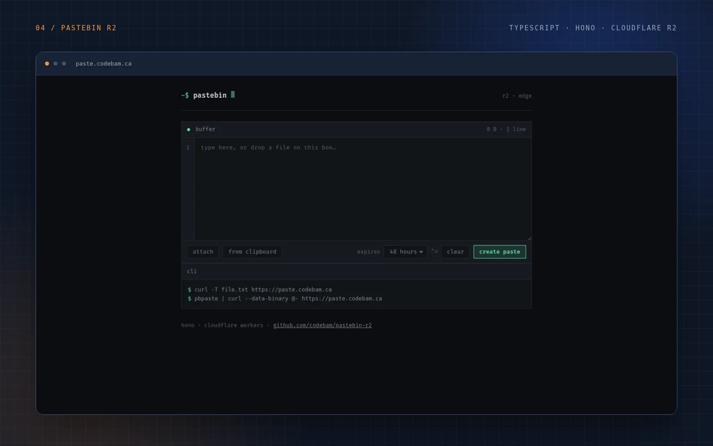

# pastebin-r2 - Cloudflare Worker Pastebin Service

This is a simple pastebin service implemented as a Cloudflare Worker using Hono framework.
It supports storing text content in R2 bucket storage with API endpoints for creating, retrieving and managing pastes.

<p align="center">
  
</p>

## Features

- Upload paste snippets (text files)
- Retrieve paste by ID
- View paste with syntax highlighting
- Delete paste functionality
- List all pastes
- Paste information endpoint
- Automatic expiry (48 hours by default, configurable per paste)
- Optional client-side ChaCha20-Poly1305 encryption (key stays in the URL fragment)
- Web UI for easy access

## Building & Running

### Using Nix (recommended for NixOS)

This project works as a Nix package:

1. Enter development shell:
```bash
cd ~/Documents/git/pastebin-r2
nix develop
```

2. Build the project:
```bash
yarn build
```

3. Run in development mode:
```bash
yarn dev
```

4. Deploy to Cloudflare Workers:
```bash
yarn deploy
```

### Direct Nix Builds

Build using Nix directly without entering shell:

```bash
nix build .#packages.default
```

## Project Structure

- `src/index.ts` - Main application code with API routes
- `src/crypto.client.mjs` - ChaCha20-Poly1305 container format, shared by the browser and the CLI helper
- `scripts/paste-crypt.mjs` - `keygen` / `encrypt` / `decrypt` CLI helper
- `dist/` - Build outputs including bundled JavaScript and HTML files
- `wrangler.toml` - Cloudflare Workers configuration
- `package.json` - Dependencies and scripts
- `tsconfig.json` - TypeScript configuration

## Expiry

Pastes expire automatically. The lifetime is stamped into the object's custom
metadata when it is written, enforced on every read, and an hourly cron trigger
(`[triggers]` in `wrangler.toml`) sweeps expired objects out of the bucket.

The default and the maximum are both **48 hours**. A shorter lifetime can be
requested with the `ttl` query parameter (or the `X-Expires-In` header) on
create/update, as plain seconds or with an `s`/`m`/`h`/`d` suffix. Values above
48 hours are clamped down, and the minimum is 60 seconds.

```bash
curl --data-binary @- 'https://example.com/?ttl=2h' < file.txt
curl -H 'X-Expires-In: 900' --data-binary @- https://example.com < file.txt
```

## Encryption

Encryption is optional and entirely client-side, like the original
pastebin-worker's ChaCha20-Poly1305 mode but without sending the key to the
server. Tick `encrypt: on` in the web UI (or add `?enc=1` to a `POST /`) and
the browser encrypts the paste before upload. The worker only stores the
ciphertext plus an `enc` marker in R2 custom metadata.

The key travels in the URL **fragment**:

```
https://example.com/view/Ab3xZ#k=<base64url-key>
```

For an attached file, the original filename is preserved client-side in the
same fragment (`&n=<url-encoded-name>`), so the viewer can download the
decrypted bytes under their original name:

```
https://example.com/view/Ab3xZ#k=<base64url-key>&n=report.pdf
```

Fragments are never sent in HTTP requests, so the server, Cloudflare logs, and
R2 never see the key, filename, or plaintext.

Opening that link runs the viewer, which fetches `/info/:id` and `/Ab3xZ`,
reads the fragment locally, and decrypts before rendering or downloading.
Binary files show a "use download" notice instead of being forced through a
text decoder. Without the key the viewer shows an unlock field instead.

The web UI encrypts attached files as raw bytes when `encrypt: on`; the textarea
and any client that POSTs bytes directly work the same way. With encryption off
the attach button keeps its original behavior (load file text into the editor).

**Keep the full URL.** If the part after `#` is lost the paste cannot be
recovered. Anyone who has the link can read it.

Format v1 (stored in R2 verbatim):

| offset | size | field |
| ---: | ---: | --- |
| 0 | 4 | magic `PBR2` |
| 4 | 1 | format version `0x01` |
| 5 | 12 | random nonce |
| 17 | N | ChaCha20-Poly1305 ciphertext followed by the 16-byte tag |

The optional original filename is not part of the container; it stays in the
URL fragment and is never uploaded.

The AAD is the 5-byte header (magic + version). The nonce is read from the
container and is cryptographically bound because the Poly1305 tag is computed
under it, so a changed header, nonce, or ciphertext byte fails authentication.
There is no compression in v1; ciphertext is plaintext length plus 33 bytes.

CLI helper (useful for `curl` and non-browser clients):

```bash
KEY=$(node scripts/paste-crypt.mjs keygen)
node scripts/paste-crypt.mjs encrypt file.txt --key "$KEY" > /tmp/body.bin
URL=$(curl -s --data-binary @/tmp/body.bin 'https://example.com/?enc=1')
echo "$URL#k=$KEY"
```

Decrypt an encrypted raw paste locally:

```bash
curl -s 'https://example.com/text/Ab3xZ' | node scripts/paste-crypt.mjs decrypt - --key "$KEY"
```

What it protects: stored R2 bytes and request logs never contain the plaintext
or key. What it does not protect: anyone holding the link can decrypt it; a
compromised Worker deployment could serve modified viewer code; metadata
(size, upload time, expiry) is still visible; there is no key recovery,
password mode, or padding.

## API Endpoints

- `POST /` - Create new paste, returns URL with ID (`?ttl=` sets lifetime)
- `GET /:id` - Retrieve paste by ID  
- `POST /:id` - Update paste content (`?ttl=` sets lifetime)
- `DELETE /:id` - Delete paste
- `GET /list` - List all paste IDs
- `GET /info/:id` - Get metadata (`expires`, plus `encrypted` / `algorithm` / `formatVersion`)
- `POST /?enc=1` - Create an encrypted paste; returns a `/view/:id` URL (append `#k=<key>`)
- `POST /:id?enc=1` - Replace an existing paste with encrypted content
- `POST /:id?enc=0` - Update and explicitly clear the encryption marker
- `GET /view/:id` - Viewer page; decrypts locally when the URL has `#k=...`
- `GET /:id/highlight` - View with syntax highlighting (also works for encrypted pastes)
- `GET /crypto.js` - Same-origin ChaCha20-Poly1305 client bundle used by the pages
- `GET /text/:id` - Get text content; encrypted pastes return raw ciphertext bytes
